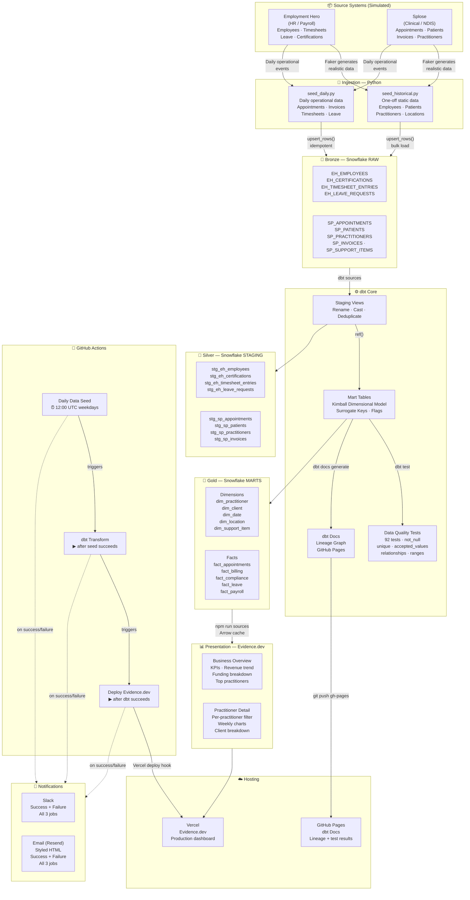

# Horizon Allied Health — Data Platform

A full end-to-end data engineering project simulating a real NDIS Allied Health organisation.
Built by **Firehawk Analytics** as a learning project covering the complete modern data stack.

---

## Architecture



---

## Tech Stack

| Layer | Technology |
|---|---|
| Data warehouse | Snowflake (NDIS_DB) |
| Transformation | dbt Core 1.11 |
| Ingestion / seeding | Python 3.12 + Faker |
| Dashboards | Evidence.dev |
| Orchestration | GitHub Actions |
| Dashboard hosting | Vercel |
| Docs hosting | GitHub Pages |
| Notifications | Slack Webhooks + Resend (HTML email) |

## Medallion Architecture

| Layer | Schema | Materialisation | Role |
|---|---|---|---|
| Bronze | `RAW` | Tables (append/upsert) | Raw landing zone, TEXT + VARIANT columns |
| Silver | `STAGING` | Views | Renamed, cast, deduplicated |
| Gold | `MARTS` | Tables + Incremental | Kimball dims + facts, surrogate keys |

## Daily Pipeline Schedule (AEST / UTC+10)

```
10:00pm  →  Daily Data Seed      (Snowflake RAW)
11:00pm  →  dbt Transform        (STAGING + MARTS + tests)
12:00am  →  Deploy Evidence.dev  (Vercel rebuild)
```

## Links

- **Dashboard** — Vercel (Evidence.dev)
- **dbt Docs** — https://nithinprasad93.github.io/nithin-data-project/dbt-docs
- **Repository** — https://github.com/nithinprasad93/nithin-data-project
